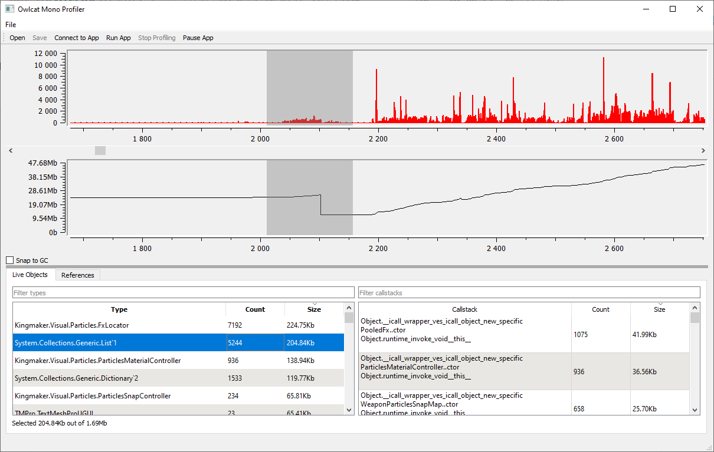

# Owlcat Mono Profiler for Unity

Owlcat Mono Profiler is a Mono memory profiler written specifically to work with games made using Unity engine. It uses a different approach than the built-in profiler, or Memory Profiler package. Instead of taking and comparing memory snapshots, it monitors heap state continiously, frame-by-frame. This enables the user to see the picture of memory allocation in real-time, and also to analyze any part of it, without having to take memory snapshots at precise moments. In particular, this approach works well with big games that allocate a lot of objects, which makes memory snapshots extremely sluggish or even unusable. You can read more about our approach and unique challenges of creating Mono profiler for Unity in [Rationale and Methodology](doc/Rationale.md) document.

Owlcat Mono Profiler is currently in early development stages. It is developed primarily by Max Savenkov as a tool for Owlcat Games, the studio behind [Pathfinder: Kingmaker](https://kingmaker.owlcatgames.com/) and [Pathfinder: Wrath of the Righteous](https://wrath.owlcatgames.com/). Expect bugs.

Owlcat Mono Profiler is a part of a planned family of Unity-related tools called Owlcat Grooming Toolkit.

## Screenshot

## Requirements

Right now, Owlcat Mono Profiler is only compatible with desktop games made with a more-or-less recent version of Unity for Windows (the lowest tested version is 2018.4.10f, but earlier version might work, too). IL2CPP is now supported with some limitations. The aim is to make it universal across the recent Unity versions, and cross-platform regarding both UI/client and target/server.

## Features
* Profile non-instrumented builds (without Script Debugging) on Windows (and on other desktop platforms in future)
* Profile Editor and builds on console and mobile platforms after some light instrumentation
* Slow-down caused by profiler is about 20-30%
* Additional memory needed for profiling depends on project, but 200Mb is enough for one or two millions of live allocations
* See memory usage in real time
* See live objects for any time period in recorded session (i.e. objects that were allocated and not freed during that period)
* See callstacks which were used to allocate live objects
* Filter types and callstacks
* See references to objects (only while the profiling session in running and only for current set of live objects)
* Force pause/unpause game

## Planned features
* Create watch/stop-lists to profile types selectively
* Console version of profiler for distribution to players and automation
* Custom events, displayed on graphs
* Allocations grouped by callstack, with tree view
* Support for non-Windows platforms

## Limitations

Right now, Owlcat Mono Profiler only profiles Mono heap usage. This means that you won't get any information about Unity heap, which is usually much bigger than Mono heap. However, you can still use this profiler to search for misuse of Unity memory, since many Unity objects also have some part stored in Mono heap (Texture objects, for example).

It often might be useful to search for particular types in Live Objects list, instead of only looking at top of the list, since a lot of objects take up very little Mono memory, but a lot of Unity memory (e.g. GameObjects, Textures, etc.).

Profiling Unity heap in addition Mono heap might be a possibility in the future.

Profiling a IL2CPP build requires modification to IL2CPP source (and a rebuild of your project). See [Profiling IL2CPP](doc/il2cpp.md).

## Building

You can download the latest stable release from Releases page, but you also can compile it from source.

### Software requird:

* Cmake 3.14
* A recent C++ compiler with C++ 17 support (on Windows, Microsoft Visual Studio is required for now: we don't support MinGW or anything else)

### External dependencies:

* Qt 5.15
* Qwt 6.1.5
* ASIO 1.18.0 (without Boost, installed automatically)
* Some relevant version of Mono (optional for now: we bundle the few necessary headers)

You will need to set up a few CMake variables for the build:

* Qt5_DIR - a path to a cmake folder inside Qt installation (e.g. d:\qt\5.15.0\msvc2019_64\lib\cmake\Qt5\)
* MONO_DLL_PATH - a path to a verion of mono-bdwgc.dll you use (necessary for test only)

## Installation/Usage

### Requirements

Owlcat Mono Profiler requires quite a bit of memory to function, especially with bigger projects. You should make sure you have at least 4Gb of RAM to spare on the machine where profiler is going to be running, and enough free storage space (a single 30-minutes profiling session can generate a few gigabytes of data). If you're going to run profiler on the same machine the target game is running, ensure you have enough RAM for both.

There are two way to use Owlcat Mono Profiler:

### Profiling Editor and instrumented builds

If you want to profile your game in Editor, or (in future) on non-Windows platforms:

0. Make sure your Firewall settings allow traffic on port which UI uses to communicate with the profiler in game (the default is 8888)
1. Copy owlcat_mono_profiler.dll to your game's Assets folder
2. Copy OwlcatMonoProfiler.cs to your game's Assets folder
3. Import the new files in Unity
4. Define PROFILE_MONO in your build settings
5. Add MonoProfiler component to some GameObject in your starting scene - it will automatically activate profiling (alternatively, you can DllImport and call StartProfiling and EndProfilingFrame functions yourself)
6. Run the game in Editor or build it, and then run the resulting executable. Your game should hang while waiting for connection and resume after it is established.
7. Run profiler UI and use "Connect to app" button to connect to your app. Use "127.0.0.1" IP, if it is running on the same machine as the profiler.

### Profiling non-instrumented builds

You can profile any Unity-based game on Windows as long as you have appropriate PDB for the version of Unity Player it uses, without rebuilding it.

0. Make sure your Firewall settings allow traffic on port which UI uses to communicate with the profiler in game (the default is 8888)
1. Find UnityEngine pdb file corresponding to the version of Unity and type of build target game uses (use DumpBin utility that is available within Microsoft Visual Studio Command Prompt: the name and guid of pdb can be found by calling dumpbin /HEADERS UnityPlayer.dll and looking at "Debug directories" section). The pdb file can usually be found inside your Unity installation's folder, or on Unity symbol server (http://symbolserver.unity3d.com/). Copy this pdb file to the same folder where target game's executable file resides.
2. Run profiler UI and use "Run app" button. Select game's executable file, specify necessary command line arguments and port and press OK
3. The game should start, and profiler should connect to it after 5-second delay